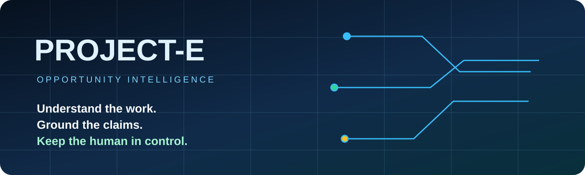
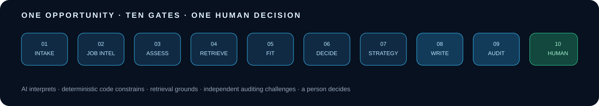
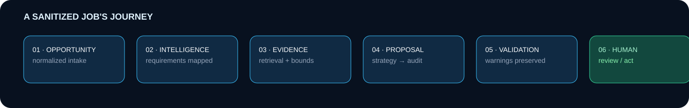
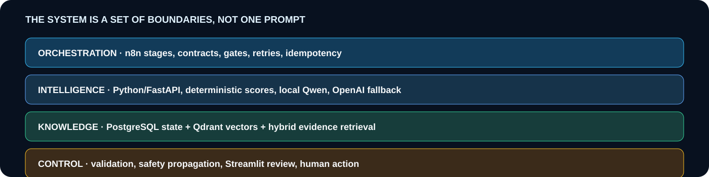
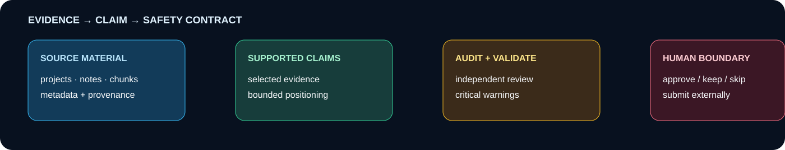
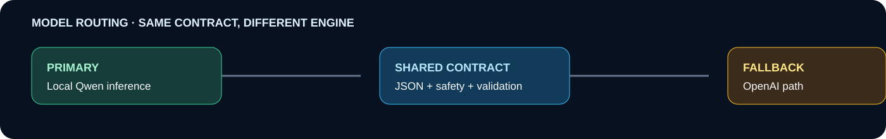

<div align="center">
  
  <p><strong>From a new opportunity to an evidence-grounded, independently audited proposal — with the final action still in human hands.</strong></p>
  <p><a href="docs/PRODUCT_TOUR.md">Explore the interface</a> · <a href="docs/ARCHITECTURE.md">Read the architecture</a> · <a href="docs/CASE_STUDY.md">Follow one opportunity</a> · <a href="tools/run_dashboard_demo.ps1">Run the fictional demo</a></p>
</div>

<p align="center"> </p>

## The product

Project-E is a personal AI opportunity-intelligence platform. It turns an incoming Upwork opportunity into a structured decision: what the client needs, whether the work is attractive, which parts fit the operator's evidence, what can safely be claimed, and what a human should review before taking action.

This is deliberately more than a proposal generator. The system combines n8n orchestration, Python services, PostgreSQL state, Qdrant hybrid retrieval, local Qwen inference, an OpenAI fallback, deterministic scoring, independent auditing, and a Streamlit control center. The person still opens Upwork and decides whether to apply.



## What happens to one opportunity?

| 01 · Intake | 02 · Understand | 03 · Evaluate | 04 · Ground | 05 · Decide |
| --- | --- | --- | --- | --- |
| A notification becomes a normalized job record. | Requirements, budget, client signals and deliverables become structured intelligence. | Deterministic opportunity and personal-fit scores make the recommendation inspectable. | Hybrid retrieval finds relevant professional evidence and bounds what may be claimed. | Strategy, writer, auditor and validators prepare a decision-ready report. |



## A review surface built for decisions

The dashboard is a control center, not a chatbot transcript. It exposes workspaces, scores, warnings, evidence, proposal, audit, report and history needed to make a deliberate call.

<table><tr><td width="50%"><br><sub><strong>Opportunity inbox</strong> · scores, recommendations, warnings and review entry point.</sub></td><td width="50%"><br><sub><strong>Evidence view</strong> · source-backed material beside the decision it informs.</sub></td></tr><tr><td><br><sub><strong>Proposal and audit</strong> · generated copy and independent checks.</sub></td><td><br><sub><strong>Intelligence report</strong> · the complete structured record.</sub></td></tr></table>

The important actions are explicit:

- **Review job** opens the structured review workspace.
- **APPROVE** records readiness for application action; it does not submit to Upwork.
- **KEEP REVIEWING** preserves the opportunity in Reviewing.
- **SKIP** records a deliberate decision not to pursue it.
- **Open Upwork Job** navigates outward; the external application remains human.
- **Report Archive** keeps saved report versions available.

The complete click-by-click guide is in [PRODUCT_TOUR.md](docs/PRODUCT_TOUR.md).

## Why the architecture is split into stages

Project-E uses AI where interpretation helps, deterministic code where rules must remain rules, retrieval where claims need evidence, and a second model path where generated content needs independent scrutiny.



The production graph is represented publicly through sanitized workflow examples and a credential-free fictional demo. See [ARCHITECTURE.md](docs/ARCHITECTURE.md) and [ENGINEERING.md](docs/ENGINEERING.md).

## Evidence and truth boundaries

Project-E combines dense BGE-M3 embeddings, sparse/BM25-style signals, reciprocal-rank fusion and metadata-aware selection. Evidence is carried into strategy and proposal generation with explicit boundaries.



Unsupported high-risk positioning such as “expert”, “senior”, “production” or “real-time” is not silently softened downstream. An unresolved critical warning remains visible to the writer and final validator. Read [SAFETY_AND_EVIDENCE.md](docs/SAFETY_AND_EVIDENCE.md).

## Local first, controlled fallback

The primary inference path is local Qwen through the configured model gateway. A narrowly defined OpenAI technical fallback exists for model/runtime failures. Both paths consume the same structured contracts, safety requirements and deterministic post-validation.



## Engineering that survives failure

Project-E has been refined through real operational failures: local context limits, auditor output ceilings, unsupported positioning that could outlive an upstream warning, escaped HTML comparison, and PostgreSQL dollar amounts that n8n could misread as positional parameters. Each incident became a regression contract or deployment guardrail. [RELIABILITY.md](docs/RELIABILITY.md) tells those stories as observed failure → root cause → fix → protection.

## Run the privacy-safe demo

The public demo is isolated, fictional and self-contained. It does not need PostgreSQL, Qdrant, n8n, Upwork, Gmail, model credentials or network access.

```powershell
.\tools\run_dashboard_demo.ps1
```

The repository also contains a credential-free [fictional n8n flow](workflows/demo/fictional-end-to-end-demo.json), representative workflow contracts, ordered PostgreSQL migrations, mock job-reader service and sanitized reports.

## Explore the showcase

| Start here | Go deeper |
| --- | --- |
| [Product tour](docs/PRODUCT_TOUR.md) · every important screen and action | [Architecture](docs/ARCHITECTURE.md) · stage boundaries and system reasoning |
| [Case study](docs/CASE_STUDY.md) · one opportunity from intake to decision | [Engineering](docs/ENGINEERING.md) · contracts, idempotency and deployment |
| [Reliability](docs/RELIABILITY.md) · failure hardening with regression protection | [RAG and data](docs/RAG_AND_DATA.md) · Qdrant, PostgreSQL and evidence flow |
| [Safety and evidence](docs/SAFETY_AND_EVIDENCE.md) · claim boundaries and human review | [Security and privacy](docs/SECURITY_AND_PRIVACY.md) · what is intentionally excluded |

## Honest scope

Project-E is an early-production personal system and engineering portfolio project. It is not an enterprise SaaS product, an automatic Upwork application bot, or a claim of commercial scale. Public examples use fictional or sanitized data. The private browser automation and live credentials are intentionally excluded.

I designed and built this system to make AI-assisted opportunity evaluation more inspectable, evidence-grounded and controllable.

---

All rights reserved. See [NOTICE.md](NOTICE.md).
