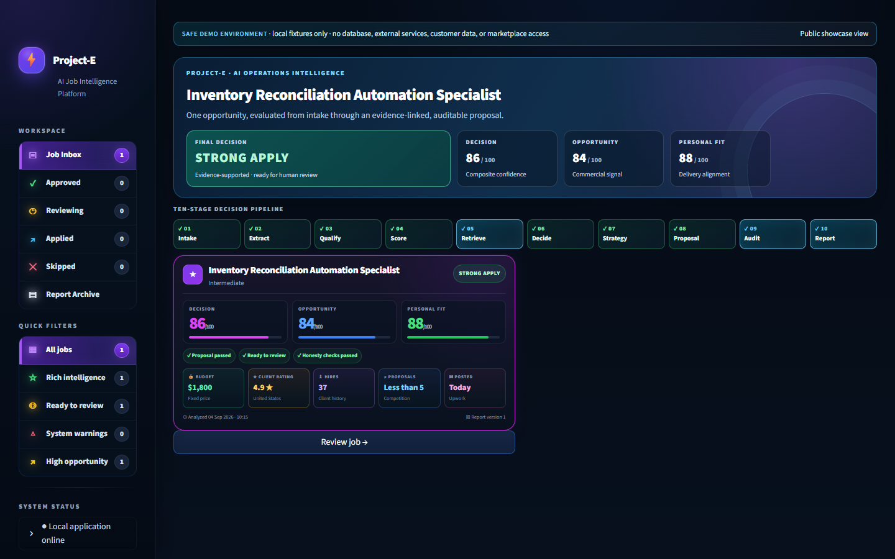
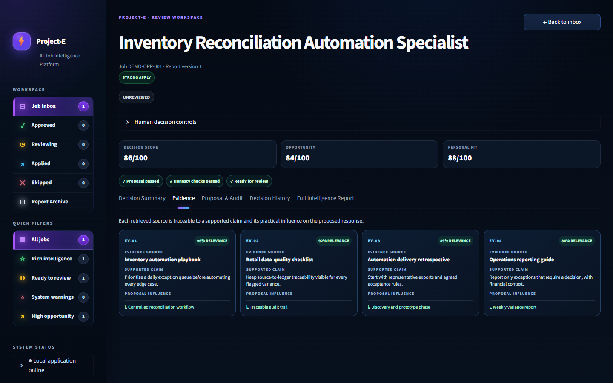
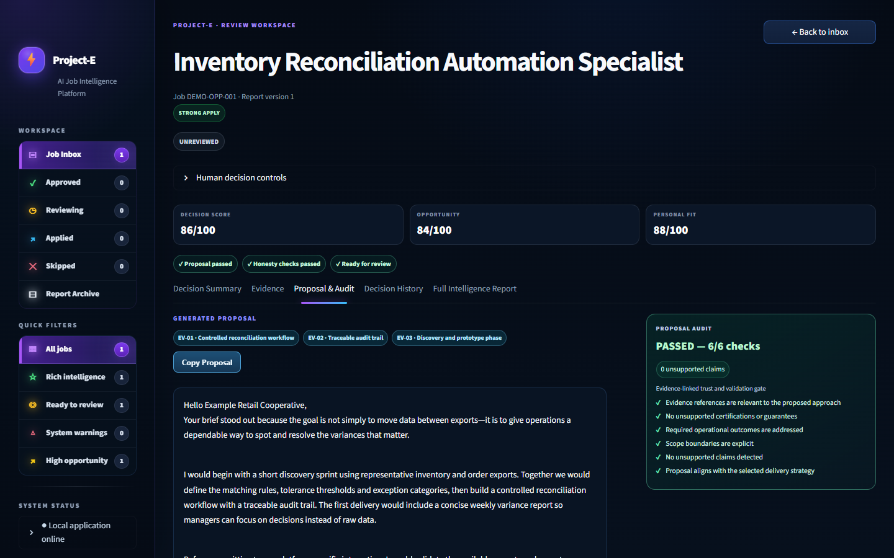
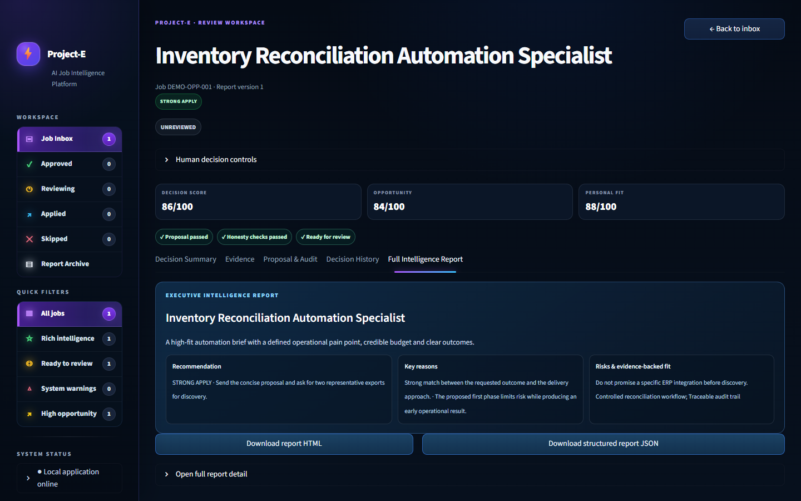

# Project-E · AI Opportunity Intelligence

> An independently designed and built working local system that turns an incoming opportunity into an evidence-grounded, auditable proposal and a clear human decision—demonstrated publicly with privacy-safe fictional data.




## Problem → Solution → Outcome

| Problem | Solution | Outcome |
| --- | --- | --- |
| Opportunities, research notes, scoring, proposal drafting, and quality checks are often disconnected. | Project-E orchestrates a validation-first flow: normalize the opportunity, score it deterministically, retrieve relevant evidence, generate a proposal, then audit it independently. | A reviewer receives a single decision-ready workspace with traceable evidence, explicit guardrails, and final human control. |

## Ten-stage decision pipeline


## What makes this different

- **Evidence-grounded proposals** — retrieved material is visible beside the claim it supports and the proposal choice it influences.
- **Deterministic scoring** — explicit opportunity and personal-fit components make the recommendation inspectable rather than opaque.
- **Independent proposal audit** — proposal quality, unsupported claims, required points, and scope boundaries are checked after generation.
- **Human approval** — the system recommends; a person approves, keeps reviewing, skips, or records an application decision.
- **Validation and failure handling** — guarded workflow deployment examples and regression tests make mismatches and unsafe states visible.
- **Concurrency and idempotency protection** — the architecture documents duplicate-work prevention and controlled state transitions rather than assuming a happy path.

## Review experience

<table>
  <tr>
    <td width="50%"><strong>Main dashboard</strong><br><a href="assets/screenshots/01-main-opportunity-dashboard.png"></a></td>
    <td width="50%"><strong>Evidence view</strong><br><a href="assets/screenshots/02-evidence-view.png"></a></td>
  </tr>
  <tr>
    <td width="50%"><strong>Proposal and audit</strong><br><a href="assets/screenshots/03-proposal-and-audit.png"></a></td>
    <td width="50%"><strong>Intelligence report</strong><br><a href="assets/screenshots/04-full-intelligence-report.png"></a></td>
  </tr>
</table>

## Architecture and technology stack

| Layer | Role | Technology |
| --- | --- | --- |
| Orchestration | Stage-based automation, validation gates, delivery safety | n8n workflow exports and PowerShell deployment guardrails |
| Intelligence | Deterministic opportunity/fit scoring, proposal strategy, audit | n8n Code nodes and structured JSON contracts |
| Knowledge retrieval | Evidence retrieval pattern for proposal grounding | Qdrant-compatible collection design and embedding configuration |
| Application services | Job-reading API contract and browser-safe mock | Python, FastAPI, Playwright contract documentation |
| Data | Reports, review state, audit/history, migrations | PostgreSQL and seven ordered migrations |
| Human interface | Review, evidence traceability, proposal and report actions | Streamlit and local fictional fixtures |

For the detailed component relationship, see [architecture](docs/ARCHITECTURE.md), the [workflow map](docs/WORKFLOW_MAP.md), [database setup](docs/DATABASE_SETUP.md), and [configuration guide](docs/CONFIGURATION.md).

## Verified engineering evidence

- **29 run · 28 passed · 1 intentionally skipped** — the database-rebuild test skips unless an empty disposable PostgreSQL DSN is supplied.
- Dashboard demo contracts verify fixture isolation, structured report content, audit checks, and the review workspace.
- Deployment tests exercise dry-run behavior, workflow identity checks, credential-reference mismatch detection, version drift, rollback handling, and state safety.
- The showcase includes a complete ordered PostgreSQL migration chain and a safe mock job-reader contract.

Validation is intentionally local and repeatable. See [security and privacy](docs/SECURITY_AND_PRIVACY.md) and [limitations](docs/LIMITATIONS.md) for the boundaries of that evidence.

## Run the privacy-safe demo

The dashboard demo is self-contained: it uses one fictional opportunity and local JSON/HTML fixtures. It does **not** require PostgreSQL, n8n, Qdrant, Gmail, a marketplace account, or network access.

```powershell
.\tools\run_dashboard_demo.ps1
```

Open the local Streamlit address printed by the command. Demo mode is selected with `PROJECT_E_DASHBOARD_MODE=demo`; leaving it unset preserves the normal PostgreSQL-backed dashboard path. The separate [fictional n8n demo](workflows/demo/fictional-end-to-end-demo.json) is importable and uses Code nodes only.

## Repository map

| Path | Purpose |
| --- | --- |
| [`dashboard/`](dashboard/) | Streamlit interface, database facade, and in-memory demo backend |
| [`workflows/representative/`](workflows/representative/) | Three sanitized representative workflow examples |
| [`workflows/demo/`](workflows/demo/) | Credential-free fictional end-to-end n8n demonstration |
| [`database/migrations/`](database/migrations/) | Ordered, rerunnable PostgreSQL migration chain |
| [`services/job-reader/`](services/job-reader/) | Safe mock API contract; no private browser automation included |
| [`examples/`](examples/) | Fictional opportunity, evidence, report, and workflow-output fixtures |
| [`tools/`](tools/) | Guarded deployment pattern and local demo launcher |
| [`tests/`](tests/) | Regression, migration, deployment, and demo tests |
| [`docs/`](docs/) | Architecture, configuration, security, policy, and limitation notes |

## Honest scope, privacy, and policy boundaries

- This is a curated engineering showcase, **not** a production-ready SaaS product or a deployment package for a live customer environment.
- The public demo contains fictional data only. It excludes customer records, generated proposals for real opportunities, live identifiers, credentials, execution history, deployment state, browser profiles, OAuth material, and backups.
- Representative workflows remove credential references and disable downstream production calls. They explain architecture; they are not drop-in production deployment artifacts.
- The private browser-automation component is intentionally withheld. Automated marketplace collection can introduce policy, account, and privacy concerns; see the [policy notice](docs/UPWORK_POLICY_NOTICE.md).
- No affiliation with or endorsement by third-party platforms is claimed. Use the project only after reviewing [configuration](docs/CONFIGURATION.md), [security](docs/SECURITY_AND_PRIVACY.md), and [limitations](docs/LIMITATIONS.md).

## What this project demonstrates

For prospective clients, Project-E demonstrates the practical engineering behind a trustworthy AI automation system: workflow orchestration, Python service boundaries, relational data design, evidence retrieval, deterministic decision logic, failure-aware validation, and a polished human review surface. It is designed to make AI-assisted work more inspectable and controllable—not merely more automated.

---

All rights reserved. See [NOTICE.md](NOTICE.md).
